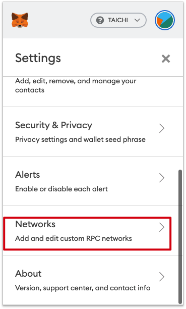
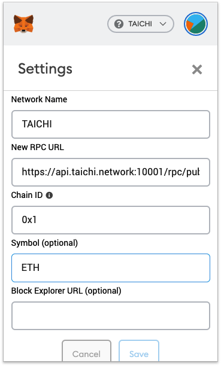
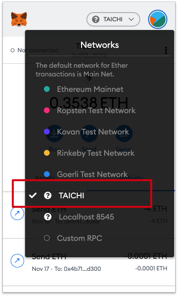

# Send private transactions by TaiChi on Ethereum

We refactor the method 'eth_sendRawTransaction', If you send tx by `/rpc/private` endpoint, tx is visible only by SparkPool.

## Nodes

* Asia-Pacific：`https://api.taichi.network:10001/rpc/private`
* Europe：`https://api-eu.taichi.network:10001/rpc/private`
* North America：`https://api-us.taichi.network:10001/rpc/private`

## Send tx by MetaMask

All tx sent from metamask will be invisible. 
You can search it from [taichi.network](https://taichi.network)

## Other

Same steps to other Ethereum wallet or client
